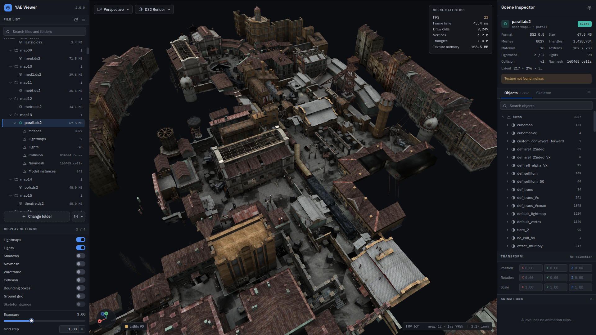
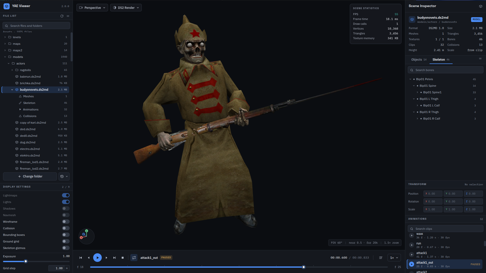

# YAE Viewer

[English](README.md) · [Русский](README.ru.md)

Просмотрщик ресурсов *You Are Empty* (2006), работающий в браузере: укажите папку с распакованными
файлами игры и смотрите уровни с лайтмапами, коллизиями и навигационной сеткой, модели — со
скелетом и анимациями. Файлы никуда не загружаются, всё читается и разбирается в браузере. Часть
[Project Empty](https://github.com/OpenYAE).

**Онлайн:** https://openyae.github.io/yae-viewer/ (публикуется из этого репозитория через GitHub
Pages). Устанавливается как PWA и после первого открытия работает офлайн.





## Как пользоваться

1. **Add folder** — выберите папку с распакованными ресурсами игры (`gameres` или любую папку с
   `maps/`, `models/`, `textures/`, `materials/`). Браузеры на Chromium один раз спрашивают доступ
   на чтение и запоминают папку в *Open recent*; остальные читают папку через обычный диалог выбора
   файлов. Папку, уровень или модель можно и просто перетащить во вьюпорт.
2. **File list** показывает только то, что вьюер открывает — уровни `.ds2` и модели `.ds2md` — в их
   папках. Всё сопутствующее находится само: коллизия `.ds2cm2`/`.ds2cm`, навигационная сетка
   `.ds2aim` (`_rebuilded` предпочтительно, как её грузит игра), страницы лайтмапов
   `<level>_lm_N.tga`, шаблоны материалов `.mat` и все текстуры, которые называют меши
   (`textures/**/*.dds`, `.tga`).
3. Открытый файл раскрывается в списке на своё содержимое (меши, лайтмапы, свет, …); каждая строка
   ведёт к соответствующей группе дерева **Objects** в инспекторе. Дерево — это панель Hierarchy из
   SDK без редактирования: выбор (клик, Ctrl — несколько, Shift — диапазон), кадрирование
   (двойной клик или `F`), скрытие «глазом» (`h`), фильтр поиском. **Skeleton** — кости модели,
   карточка **Transform** следует за выбором, **Animations** — список клипов.
4. Плеер под вьюпортом проигрывает клип; кнопка таймлайна открывает dope sheet — сначала дорожки
   выбранной кости, затем всех анимированных — с плейхедом, переходом по ключам, onion skin и
   привязкой к кадру. Ключи читаются из файла и не редактируются.

Вьюпорт: орбита мышью, `WASD`/`QE` — полёт (Shift быстрее), клик — выбор, двойной клик —
кадрирование. Пресеты камеры в выпадающем списке слева вверху (`0` perspective, `7` top, `1`
front, `3` left, `Home` — сброс). Режимы рендера: **DS2 Render** (картинка игры: diffuse × lightmap
× 2 или diffuse × вершинный свет × 2 в display-пространстве), **Lit** (свет уровня через three.js),
Albedo, Normals, Lightmap, UV checker, Wireframe. Display settings включают лайтмапы, свет, тени,
навмеш, коллизию, ограничивающие боксы, сетку (шаг в метрах, 64 юнита = 1 м) и гизмо скелета.

Поддерживается: `.ds2` (геометрия уровня, версия 0.8), `.ds2md` (модели 1.0 и старые 0.6),
`.ds2cm`/`.ds2cm2`, `.ds2aim`, `.mat`, `.dds` (DXT1/3/5, программное декодирование там, где у GPU
нет S3TC), `.tga`, `.png`/`.jpg`.

## Разработка

```bash
npm ci
npm run dev        # dev-сервер Vite на http://localhost:5180/yae-viewer/
npm run build      # проверка типов + сборка в dist/
npm run preview    # раздача dist/
```

`VITE_BASE` задаёт путь, под который собирается сайт (workflow Pages передаёт `/<репозиторий>/`).

## Откуда код

Парсеры в `src/formats/` — порт библиотеки форматов [YAE SDK](https://github.com/OpenYAE/yae-sdk)
(`sdk-desktop/packages/formats`) с двумя поправками из проверки соответствия движка: материал грани
`.ds2cm2` — пятое слово, а за заголовком анимаций типа N идут N−1 дополнительных слова. Соглашения
рендера — данные Z-up под одним поворотом в Y-up, текстуры без переворота с авторскими UV, кости и
ключи как есть, цветовой конвейер режима DS2 Render — взяты из
[YAE Engine](https://github.com/OpenYAE/yae-engine), который сверяется с игрой покадрово.
Спецификации — в [портале документации](https://github.com/OpenYAE/yae-docs).

## Правовое

*You Are Empty* и её форматы принадлежат правообладателям; вьюер не содержит ресурсов игры и
работает с файлами вашей копии. Лицензия вьюера выбирается мейнтейнерами (предлагается MIT); пока
нет файла `LICENSE`, все права защищены.
